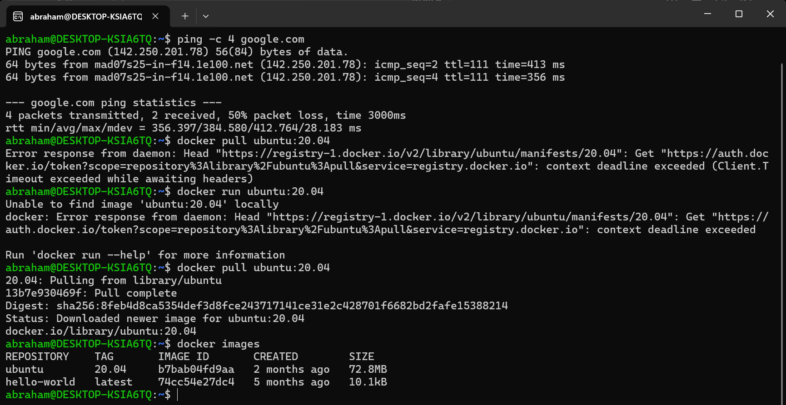
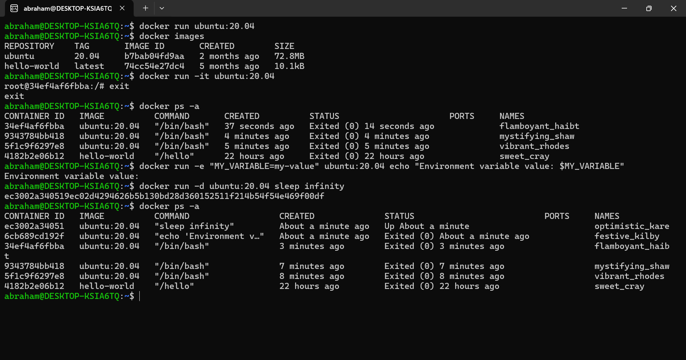
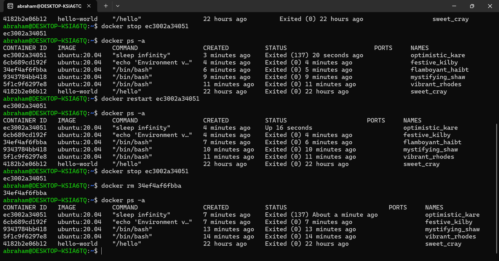
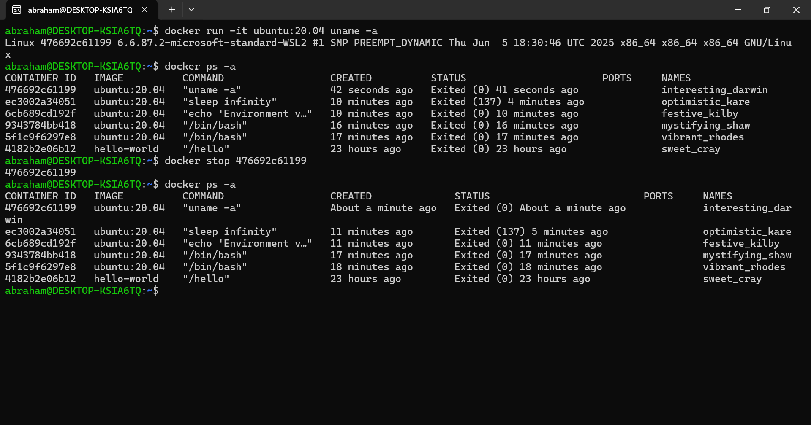
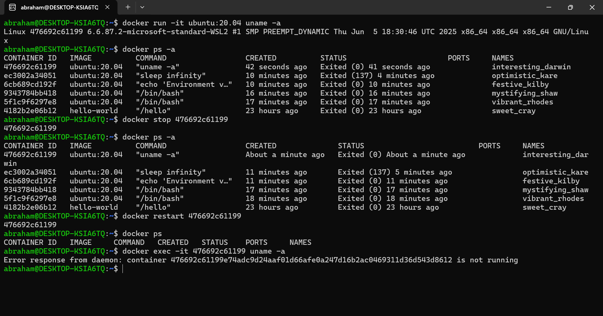
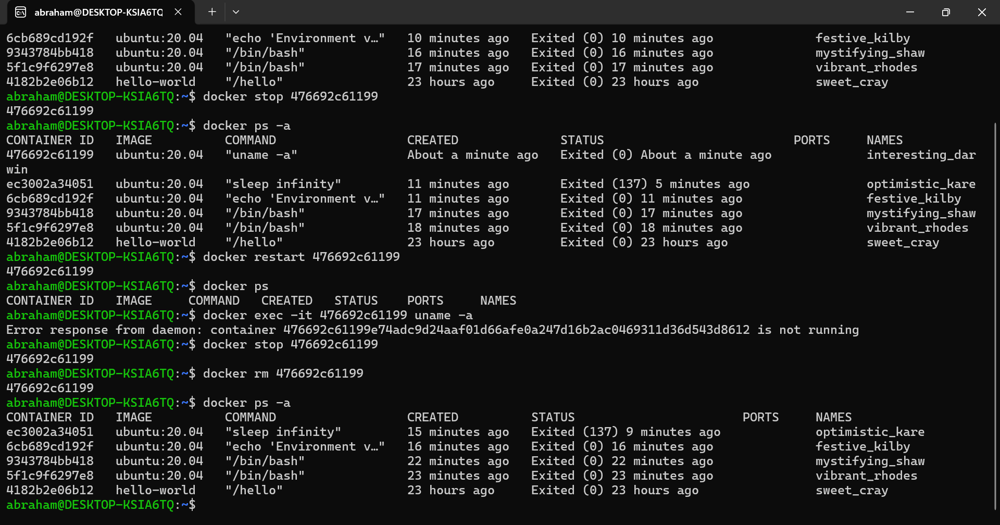

# Mini Project - Working with Docker Containers (Local Setup)

## Project Overview
This project explores Docker containers, covering their creation with `docker run`, customization (e.g., environment variables, background mode), lifecycle management (start, stop, restart, remove), and a side hustle task, executed locally on WSL Ubuntu with VS Code.

## Setup
- Initiated on Jul 04, 2025, 03:32 PM WAT.
- Used WSL Ubuntu terminal with VS Code, documented in /mnt/c/Users/User/Documents/Workspace/Shell_AWS_Mini_Project.

## Execution Steps
1. **Run Containers**:
   - Ran Ubuntu container with `docker run -it`, added environment variable (`-e`), and ran in background (`-d` with `sleep infinity`).
   - [Screenshot: `docker_image_pulled_local.png` - Shows `docker images`.]
   
   - [Screenshot: `docker_run_background_local.png` - Shows `docker ps`.]
   
2. **Manage Lifecycle**:
   - Started, stopped, restarted, and removed containers using `start`, `stop`, `restart`, and `rm`.
   - [Screenshot: `docker_lifecycle_management_local.png` - Shows `docker ps -a` after removal.]
   
3. **Side Hustle Task**:
   - Started Ubuntu container, ran `uname -a`, stopped, restarted, and removed it.
   - [Screenshot: `container_stopped_local.png` - Shows "Exited".]
   
   - [Screenshot: `container_restarted_local.png` - Shows "Up".]
   
   - [Screenshot: `container_removed_local.png` - Shows no container.]
   

## Learning Summary
This project deepened my understanding of Docker containers as lightweight, portable units that encapsulate applications and dependencies, ensuring consistency across local environments. I learned that `docker run` without `-it` or a persistent command exits immediately, and using `-it` or `-d` with `sleep infinity` keeps containers running for management. I mastered customization with `-e` and lifecycle management with `start`, `stop`, `restart`, and `rm`. The side hustle task, involving `uname -a`, stopping, restarting, and removing a container, reinforced these skills, highlighting the importance of interactive and background modes for efficient local development. This experience solidified Docker’s role in scalable, reproducible application runtime management.

## Tools Used
- **WSL Ubuntu Terminal**: For Docker commands and local execution.
- **VS Code**: For editing `README.md`.
- **Git Bash**: For version control and GitHub push.

## Project Deliverables
- **Documentation**: This `README.md` with steps and learning summary.
- **Screenshots**: 
  - `docker_image_pulled_local.png`
  - `docker_run_background_local.png`
  - `docker_lifecycle_management_local.png`
  - `container_stopped_local.png`
  - `container_restarted_local.png`
  - `container_removed_local.png`
- **Script Link**: [GitHub Repository](https://github.com/westgrin/Shell_AWS_Mini_Project)

## Conclusion 
This project successfully explored Docker container creation, customization, and lifecycle management locally, addressing the lack of container ID output with appropriate run options, with a practical side hustle task, documented for future reference, enhancing my containerization skills.